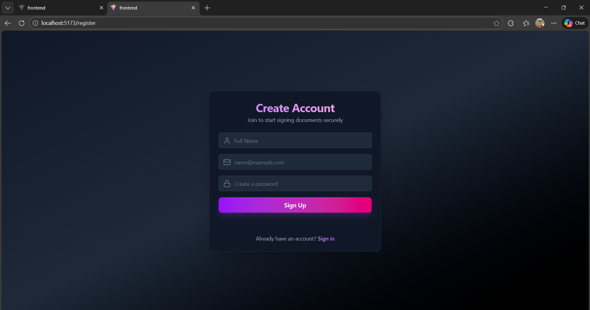
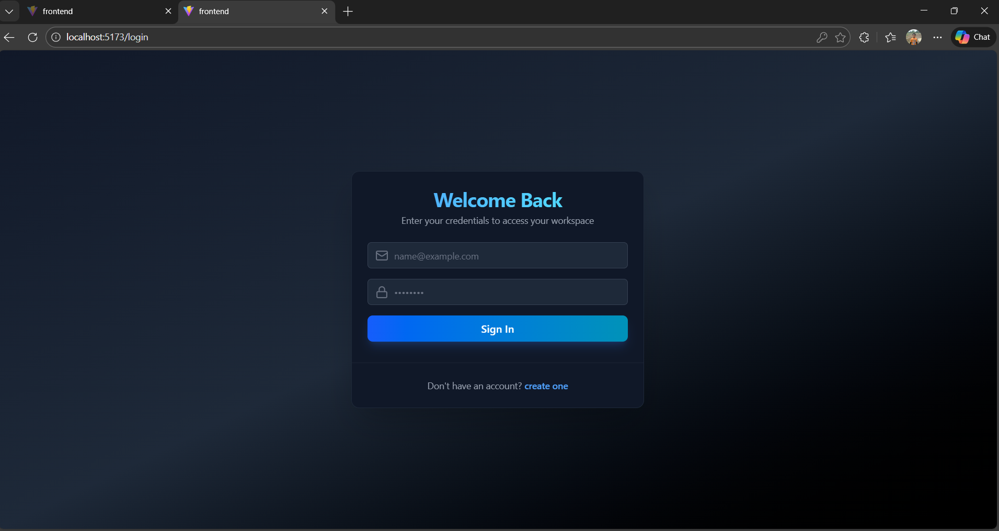
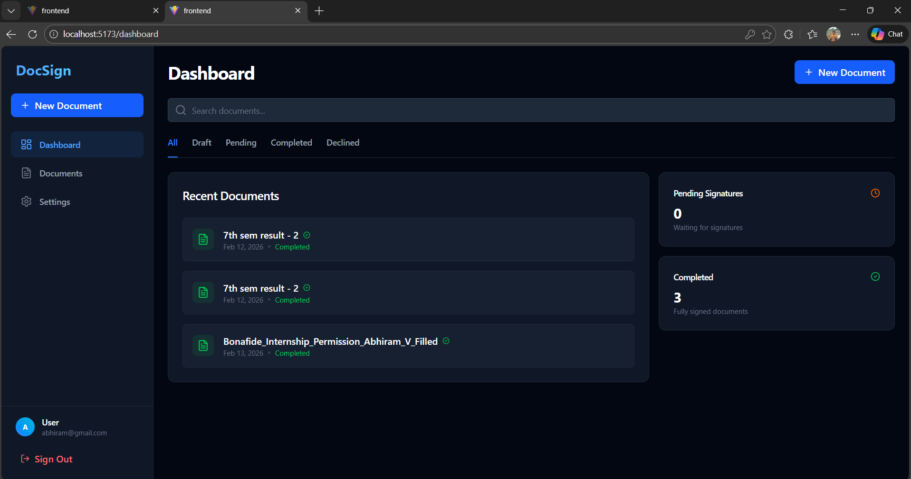
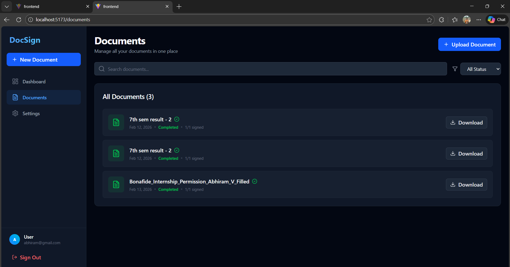
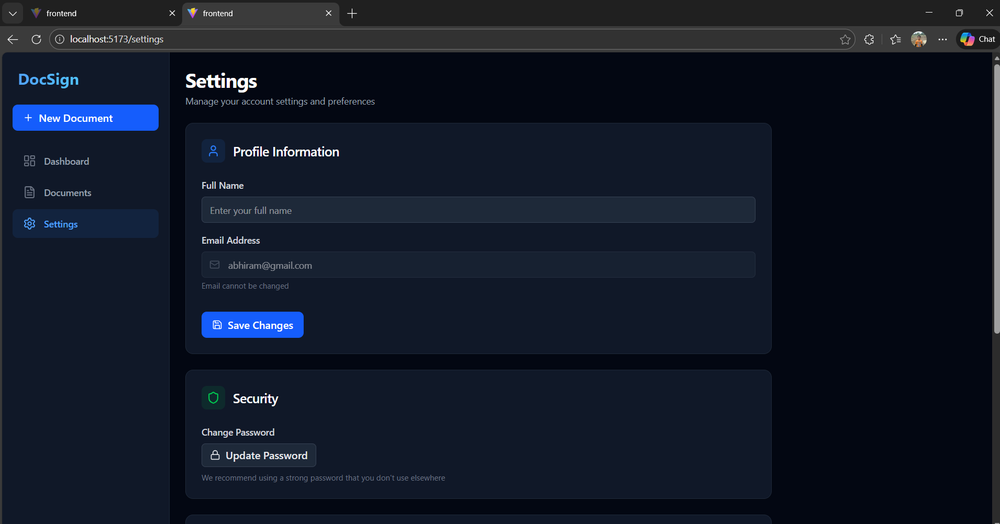

# DocSign - Enterprise Digital Signature System

DocSign is a secure, digital signature platform inspired by DocuSign, built with a focus on secure backend architecture, PDF manipulation, and audit-ready workflows.

## 🎯 Aim of the Project
- **Build a DocuSign-like digital signature system**: Implementing the full lifecycle of a document from upload to final signature.
- **Secure Backend Architecture**: Demonstrating industry-standard authentication and authorization patterns.
- **PDF Manipulation**: Real-time PDF rendering and dynamic signature embedding.
- **Audit-Ready Workflows**: Modeling real business logic with immutable signed states and status tracking.
- **Enterprise-Grade Portfolio**: Designed to go beyond simple CRUD applications by solving complex architectural challenges.

## 🧩 Problems Solved
- **Workflow Latency**: Replaces manual, paper-based signing with a streamlined digital process.
- **Lack of Traceability**: Provides a clear audit trail of who signed what and when.
- **Compliance Issues**: Standardizes the signing process to meet business verification needs.
- **Tampering Risks**: Implements status locks and immutable records to ensure document integrity.
- **Status Visibility**: Real-time dashboard to track pending and completed signatures.

## 🚀 Key Features
- **PDF Canvas Integration**: Precision placement of signature fields.
- **Real-time Signature Pad**: Responsive drawing interface for capturing digital signatures.
- **Document Recall**: Ability to revert sent documents to draft mode for repositioning.
- **Dynamic Dashboard**: Comprehensive statistics and status tracking.

## 🛠️ Technology Stack
- **Frontend**: React, TypeScript, Vite, Tailwind CSS, Lucide React.
- **Backend**: FastAPI (Python), SQLAlchemy, Pydantic, JWT Authentication.
- **Database**: SQLite (for development).
- **PDF Processing**: `react-pdf`, `react-signature-canvas`.

## 📜 How it Works
1. **Upload**: User uploads a PDF document.
2. **Prepare**: Mark specific areas for signatures using the Signature Studio.
3. **Send**: Deploy the document for signing.
4. **Sign**: Signers use the signature pad to apply their marks at exact coordinates.
5. **Complete**: Document status moves to "Completed" once all fields are signed.

## 📸 Screenshots

### Authentication
<table>
  <tr>
    <td width="50%">
      <h4>Login Page</h4>
      
      <p><em>Secure JWT-based authentication with modern UI</em></p>
    </td>
    <td width="50%">
      <h4>Registration</h4>
      
      <p><em>User registration with email and password validation</em></p>
    </td>
  </tr>
</table>

### Main Application
<table>
  <tr>
    <td width="50%">
      <h4>Dashboard</h4>
      
      <p><em>Overview with document statistics and quick actions</em></p>
    </td>
    <td width="50%">
      <h4>Documents Page</h4>
      
      <p><em>Complete document management with search and filters</em></p>
    </td>
  </tr>
  <tr>
    <td width="50%">
      <h4>Settings</h4>
      
      <p><em>User profile and notification preferences</em></p>
    </td>
    <td width="50%">
      <h4>Key Features</h4>
      <ul style="text-align: left; padding-left: 20px;">
        <li>✅ PDF Upload & Validation</li>
        <li>✅ Drag-and-Drop Signature Fields</li>
        <li>✅ Real-time Signature Pad</li>
        <li>✅ Public Signing Links</li>
        <li>✅ Document Recall & Decline</li>
        <li>✅ Audit Trail Logging</li>
      </ul>
    </td>
  </tr>
</table>

## 🚀 Getting Started

### Prerequisites
- Python 3.10+
- Node.js 16+
- npm or yarn

### Installation

1. **Clone the repository**
   ```bash
   git clone <your-repo-url>
   cd DocSign App
   ```

2. **Backend Setup**
   ```bash
   cd backend
   pip install -r requirements.txt
   ```

3. **Frontend Setup**
   ```bash
   cd frontend
   npm install
   ```

### Running the Application

1. **Start Backend Server**
   ```bash
   cd backend
   uvicorn main:app --reload
   ```
   Backend runs on `http://127.0.0.1:8000`

2. **Start Frontend Server** (in a new terminal)
   ```bash
   cd frontend
   npm run dev
   ```
   Frontend runs on `http://localhost:5173`

3. **Access the Application**
   - Open your browser and navigate to `http://localhost:5173`
   - Register a new account or login
   - Start uploading and signing documents!

## 📚 API Documentation

Once the backend is running, visit `http://127.0.0.1:8000/docs` for interactive API documentation powered by FastAPI's built-in Swagger UI.

## 🎯 Use Cases

- **HR & Recruitment**: Offer letters, NDAs, policy acknowledgements
- **Legal & Compliance**: Contract signing, consent documents, regulatory approvals
- **Freelancers & Agencies**: Client agreements, proposal approvals, invoice authorizations
- **Education**: Admission forms, certificates, consent forms
- **Healthcare & Finance**: Authorization forms, secure document approvals

## 🔒 Security Features

- **JWT Authentication**: Secure token-based authentication
- **Password Hashing**: Bcrypt encryption for user passwords
- **Email-Based Access Control**: Signature fields assigned to specific signers
- **Audit Logging**: Complete trail of all document actions
- **Status Locks**: Immutable records once documents are completed

## 🛣️ Roadmap

- [ ] PostgreSQL/Supabase integration for production
- [ ] Email notifications via SMTP
- [ ] Multi-page PDF support enhancements
- [ ] Document templates
- [ ] Advanced signature verification
- [ ] Mobile-responsive improvements

## 📄 License

This project is licensed under the MIT License - see the [LICENSE](LICENSE) file for details.

© 2024 All rights reserved.

---
*Built for the Modern Enterprise.*

